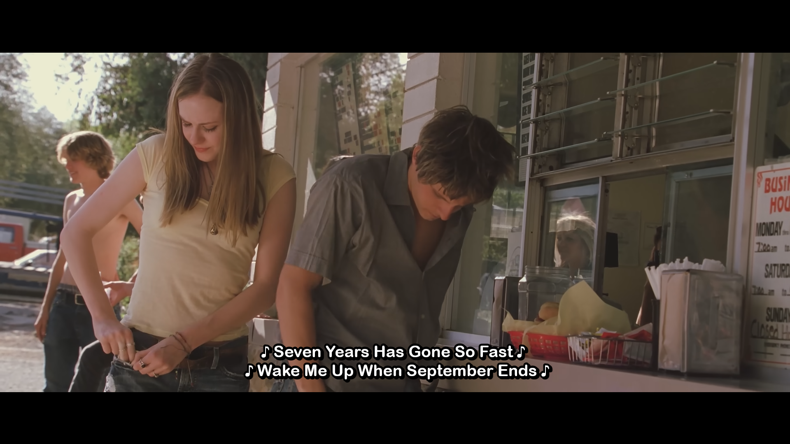

Submit any issues on [GitHub](https://github.com/DankestFke/userstyles/issues/new/choose) or through reviews.

<h1 align="center"> YouTube Netflix Subtitle </h1>

Derives from @ang3lo_azedo's [YouTube Netflix Subtitles](https://uso.kkx.one/style/206563). This userstyle focused of hardcore customization on subtitles.

I recommend you to use [Hyper's YouTube Subtitles/CC Options](https://userstyles.world/style/18961) if you prefer simplicity.

### / [Install](https://userstyles.world/api/style/23682.user.css) \/\ [Userstyles.world](https://userstyles.world/style/23682/) \\

### Table of content
[ [Screenshot](#screenshot) |
[Features](#Features) |
[Changelog](#Changelog) |
[Notice](#Notice) ]

## Screenshot
<figcaption>1. Default Settings</figcaption>

 
<figcaption>2. Edited</figcaption> 
 

> Third image is not related to image 2. It shows customization options.
## Features
- Font Configuration
- Subtitle Window Configuration
- [Hide on Hover]((https://userstyles.world/style/6854/youtube-hide-subtitles-when-mouse-over))
- Rounded text outline (Thanks to  [Hyper's YouTube Subtitles/CC Options](https://userstyles.world/style/18961))

> [!IMPORTANT]
> Firefox and Chromium browsers have different -webkit-text-stroke methods, you will get rounded outline on Firefox with "Sharp Outline" for now

#### Bucket List
- [ ] Default Options
- [ ] Settings Optimization
- [ ] Presets
- [ ] Custom Font

 

***

 

# Changelog
### 2025816.1.5
- Settings Overhaul
- Added Shadow
- Change Rounded Outline
	- Added Round Smoothness (From [Hyper's YouTube Subtitles/CC Options](https://userstyles.world/style/18961))
- Added "Blend Mode"
- Refactored Codes

__This might be the last update for now__

### 2025816.1.37
- Hide subtitle on hover minor fix for animated subtitles

### 2025816.1.35
- Added ["Hide youtube subtitles when mouse hover"](https://userstyles.world/style/6854/youtube-hide-subtitles-when-mouse-over)

### 2025816.1.30
- First changelog
- Added the ability to select to apply subtitle styling to either normal subtitle or styled subtitle.

 

> [!NOTE]  
> Some ideas might not be added because YouTube already included themselves.  
Rounded Outline might affect low spec user.  
SF Pro fonts is Apple's trademark and under APSL V2 license.